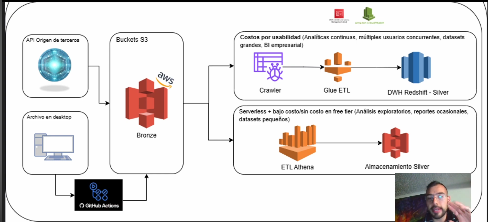
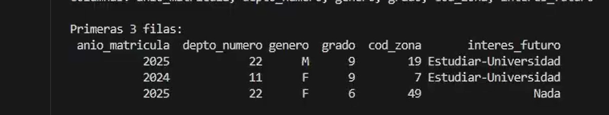

# Clinical Analytics


## Architecture



### Producer

Api request will be configurated in GitHub actions, emulating daily incoming data. Taking the data from a email and ingest into the S3.

### Processing 
This project can be deployed in two main levels,

* Medium cost: Using glue clawlers, glue etl and DWH redshift.
* Low cost: S3 silver layer and Etl Athena 


## Service intantiation

Create the Buckets and services using the following:
```sh
$BUCKET_NAME="itz-s3-eastus2-bronze-001" 
$REGION="us-east-2"


aws s3 mb s3://$BUCKET_NAME --region $REGION


@('raw/zones', 'raw/students', 'processed/', 'staging/', 'uploads/') | ForEach-Object {
    aws s3api put-object --bucket $BUCKET_NAME --key $_ --region $REGION
}

# validate folder creation
aws s3 ls s3://$BUCKET_NAME/ --recursive 
```

Taking as reference




## References

- Project video: https://www.youtube.com/watch?v=hWbhYi6oNsY
- Project Code: https://github.com/juansanm/ingest/